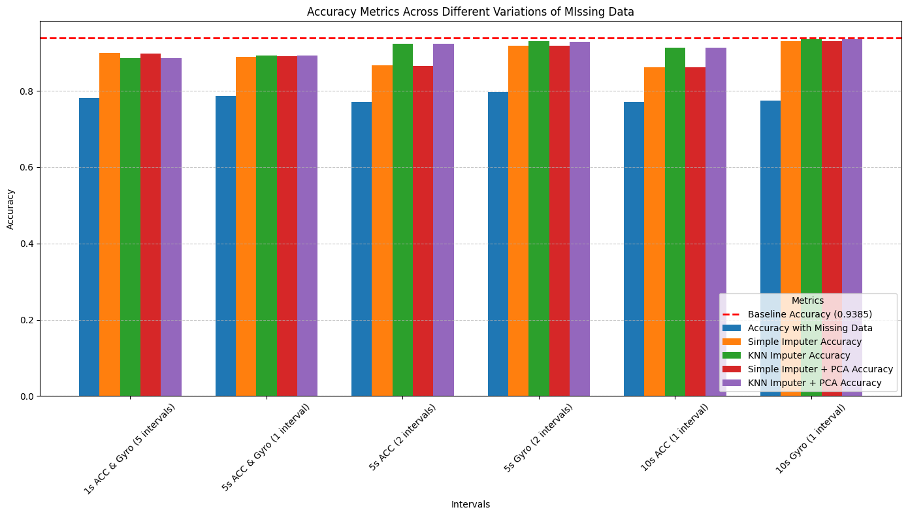

# Robust Activity and Subject Recognition with LSTM & Handling Missing Sensor Data in the UCI HAR Dataset

I am using Human Activity recognition dataset with by UCI (https://archive.ics.uci.edu/dataset/240/human+activity+recognition+using+smartphones) for my experiments. The Human Activity Recognition database was built from the recordings of participants performing activities of daily living (ADL) while carrying a waist-mounted smartphone with embedded inertial sensors. The objective is to classify activities into one of the six activities performed
- WALKING
- WALKING_UPSTAIRS
- WALKING_DOWNSTAIRS
- SITTING
- LAYING
- STANDING
 
There were 30 participants and each person performed the activities wearing a smartphone (Samsung Galaxy s2) on their waist. The dataset has 10299 entries & 561 features divided into train and test for classification purposes 

#### There are two major problem that we identified with the HAR dataset
- Majority of prior research on HAR dataset focuses on activity recognition, but we plan to use to the dataset to recognize the activity and subject performing the activity
- There is also very little research on how to deal with missing sensor data. In real life sensors fail thus making it difficult to do any sort of prediction  

#### Evaluation
- I used LSTM to do both classification. Look at the results here 
    - Activity recognition was straightforward 93% accuracy
    - Subject recognition was tricky The UCI HAR dataset is primarily designed for activity recognition, not subject recognition. While it does include subject identifiers, the distribution of subjects between the training (21 subjects) and testing (9 subjects) datasets is uneven, with no explicit focus on ensuring uniform subject representation across both sets. So I combines both train and test set and split the data so both train and test have all 30 subjects. I did the split 80/20. The accuracy was 80% which is good since random would have been 1/30=3.3%
        - If we look at the subject class accuracy per activity then the picture becomes much more clear. For all subjects its the sitting, standing and laying classes thats causing issues. Since these are stationary activity it might look very similar across all subjects (Look at my github for charts)

#### Missing Data Simulation
- The dataset is sampled at 50 HZ. So 50 times per second. And out of the 562 features, 345 were related to accelerometer and 213 were related to gyroscope. My whole idea was for a couple of seconds (it could be 1-10 seconds) one of the sensor fails. For example 5 seconds of accelerometer data went missing and 5 seconds of accelerometer data went missing. I used “SimpleImputer” and “KNNImputer” with and without PCA (principal component analysis) to fill in the missing data and then use the model to evaluate. 
    - For activity recognition baseline accuracy was 93 %, with missing data the accuracy was 78% and with imputed data with 90 % (not bad)
    - For activity recognition baseline accuracy was 80 %, with missing data the accuracy was 61% and with imputed data with 73 % (also not that bad)


## LSTM model used for training both Activity recognition and subject recognition

```
from keras.models import Sequential
from keras.layers import LSTM, Dense, Conv2D, MaxPooling2D, Flatten, Dropout


model = Sequential()
# RNN layer
model.add(LSTM(units = 128, input_shape = (X_train.shape[1], X_train.shape[2])))
model.add(Dropout(0.2))
model.add(Dense(units = 64, activation='relu'))
model.add(Dense(y_train.shape[1], activation = 'softmax'))
model.compile(loss='categorical_crossentropy', optimizer='adam', metrics=['accuracy'])

```


## Activity Recognition			
--------------------------------
### Test Accuracy with no missing data is `0.9389`			


### Accuracy with simulated missing Data

 - #### Percentage of rows with some missing sensor data is `(10*50)/2060 = 24.27%` for all experiments (its always 10 seconds of data in total missing)			
 - #### Total number for component for PCA was `175`			

| Feature | Missing Data cells (%) | Accuracy with missing data | Simple Imputer Accuracy | KNN Imputer Accuracy | Simple Imputer + PCA Accuracy | KNN Imputer + PCA Accuracy |
|---|---|---|---|---|---|---|
| 1 Second ACC & 1 Second Gyro (5 intervals) | 12.07 | 0.7814 | 0.9026 | 0.8924 | 0.8988 | 0.8897 |
| 5 Second ACC & 5 Second Gyro (1 interval) | 12.06 | 0.7729 | 0.8931 | 0.8900 | 0.8907 | 0.8870 |
| 5 Second ACC (2 intervals) | 14.91 | 0.7811 | 0.8629 | 0.9117 | 0.8612 | 0.9104 |
| 5 Second Gyro (2 intervals) | 9.22 | 0.7798 | 0.9365 | 0.9365 | 0.9348 | 0.9338 |
| 10 Seconds ACC (1 interval) | 14.91 | 0.7940 | 0.8836 | 0.9277 | 0.8812 | 0.9263 |
| 10 Seconds Gyro (1 interval) | 9.22 | 0.7787 | 0.9389 | 0.9300 | 0.9375 | 0.9267 |





## Subject Recognition			
--------------------------------

FOr Subject recognition we have to modify the data. In the data there are a total of 30 subjects but the training data has 21 subject and test data habe 9 subjects, which is not ideal for doing subject recognition. We need a sataset where we would have all 30 subjects in both train and test set. So I have done the following to combine and split the data.

### Creation of new test set by combining all data

```
# training data
X_train = pd.read_csv('UCI HAR Dataset/train/X_train.txt', delim_whitespace=True, header=None)
X_train.columns = features
X_train['Activity'] = pd.read_csv('UCI HAR Dataset/train/y_train.txt', names=['Activity'])
y_train_subject = pd.read_csv('UCI HAR Dataset/train/subject_train.txt', names=['subject'])
X_train['subject'] = y_train_subject

# test data
X_test = pd.read_csv('UCI HAR Dataset/test/X_test.txt', delim_whitespace=True, header=None)
X_test.columns = features
X_test['Activity'] = pd.read_csv('UCI HAR Dataset/test/y_test.txt', names=['Activity'])
y_test_subject = pd.read_csv('UCI HAR Dataset/test/subject_test.txt', names=['Activity'])
X_test['subject'] = y_test_subject

all_X_data = np.concatenate((X_train, X_test))
all_y_data = np.concatenate((y_train_subject, y_test_subject))

X_train, X_test, y_train, y_test = train_test_split(all_X_data, all_y_data, test_size=0.2, random_state=0)


```


### Test Accuracy with no missing data is `0.8019`


If we look at the subject class accuracy per activity then the picture becomes much more clear. For all subjects its the sitting standing and laying thats causing issues. Since these are stationary activity it might look very similar across all subjects 


### Accuracy with simulated missing Data

 - #### Percentage of rows with some missing sensor data is `500/2060 = 24.27%` for all experiments (its always 10 seconds of data in total missing)			
 - #### Total number for component for PCA was `175`			

| Feature | Missing Data cells (%) | Accuracy with missing data | Simple Imputer Accuracy | KNN Imputer Accuracy | Simple Imputer + PCA Accuracy | KNN Imputer + PCA Accuracy |
|---|---|---|---|---|---|---|
| 1 Second ACC & 1 Second Gyro (5 intervals) | 12.06 | 0.6165 | 0.6383 | 0.7359 | 0.6325 | 0.7281 |
| 5 Second ACC & 5 Second Gyro (1 interval) | 12.06 | 0.6189 | 0.6402 | 0.7364 | 0.6339 | 0.7364 |
| 5 Second ACC (2 intervals) | 14.91 | 0.6135 | 0.6378 | 0.7383 | 0.6310 | 0.7276 |
| 5 Second Gyro (2 intervals) | 9.21 | 0.6169 | 0.6461 | 0.7504 | 0.6412 | 0.7456 |
| 10 Seconds ACC (1 interval) | 14.91 | 0.6145 | 0.6349 | 0.7388 | 0.6276 | 0.7325 |
| 10 Seconds Gyro (1 interval) | 9.21 | 0.6165 | 0.6538 | 0.7524 | 0.6432 | 0.7475 |


